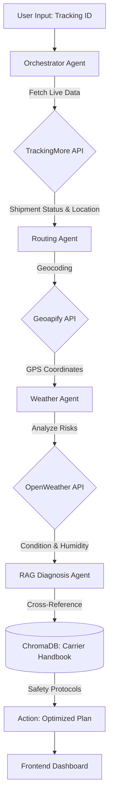

# Freyt: RAG-Based Multi-Agent Logistics System 🚛💎

Freyt is a professional-grade logistics management platform that orchestrates autonomous AI agents to track shipments, analyze weather risks, and optimize routes using **Retrieval-Augmented Generation (RAG)**.

> ### Engineered with ❤️ by Ankush Singh


## 🧠 System Architecture & Workflow

Freyt uses a collaborative agentic workflow. When a user enters a tracking ID, the "Brain" initiates the following sequence:



## 📑 Technical Blueprint & Agentic Reasoning

Freyt leverages a **Distributed Multi-Agent Architecture** to solve high-entropy logistics challenges. The system is designed around four core technical pillars:

1.  **Autonomous Agentic Orchestration**: Uses a hierarchical control pattern where a lead Orchestrator manages state transitions between specialized worker agents (Weather, Routing, RAG).
2.  **Retrieval-Augmented Generation (RAG)**: Implements a production-grade RAG pipeline using **Recursive Character Text Splitting** and **ChromaDB Vector Store** to ground LLM inference in authoritative carrier documentation (DHL GTC).
3.  **Semantic Context Injection**: Automatically enriches agent prompts with real-time telemetry (Weather, GPS, Transit Status) to ensure context-aware decision making.
4.  **Asynchronous API Synchronization**: Handles non-blocking integration with multiple third-party providers including **TrackingMore** (REST), **OpenWeather** (JSON/MET), and **Geoapify** (Geospatial).

## ✨ Advanced Features

- **Multi-Agent Collaborative Intelligence**: Synergistic workflow between four agents using **Gemini-1.5-Flash** for high-speed, cost-efficient inference.
- **Geospatial Intelligence (Geo-Int)**: Dynamic conversion of unstructured transit location strings into structured GPS coordinates for environmental risk modeling.
- **Deterministic vs. Probabilistic Reasoning**: Combines deterministic tracking data with probabilistic AI risk assessments for comprehensive logistics diagnosis.
- **Glassmorphism UI/UX**: High-performance React dashboard utilizing **Framer Motion** for state-driven micro-animations and **Tailwind CSS** for responsive layout orchestration.
- **Smart Demo Suite**: Categorized hub selection (Indian & Global) for instant system verification and edge-case testing.

## 🛠️ Technological Stack

| Layer | Technologies |
| :--- | :--- |
| **Logic & Orchestration** | FastAPI (Python), LangChain |
| **Generative AI** | Google Gemini (Gemini Pro, Embedding-001) |
| **Data Persistence** | ChromaDB (Vector store hosted locally/cloud) |
| **User Interface** | React 18, Vite, Framer Motion, Tailwind |
| **Intelligence APIs** | TrackingMore (Logistics), OpenWeather (Met), Geoapify (GIS) |

## 🚀 Getting Started

### 1. Prerequisites
- Python 3.9+
- Node.js 18+
- API Keys for Gemini, TrackingMore, OpenWeather, and Geoapify.

### 2. Environment Setup
Create a `.env` file in the `backend/` directory:
```env
GOOGLE_API_KEY="your_gemini_key"
TRACKINGMORE_API_KEY="your_trackingmore_key"
OPENWEATHER_API_KEY="your_weather_key"
GEOAPIFY_API_KEY="your_geoapify_key"
```

### 3. Installation

**Backend:**
```bash
cd backend
pip install -r requirements.txt
python main.py
```

**Frontend:**
```bash
cd frontend
npm install
npm run dev
```

## 📈 Usage Modes

- **Real Mode**: Enter any real tracking ID from DHL, FedEx, etc.
- **Demo Mode**: Click the dedicated buttons for **Mumbai**, **Delhi**, or **BLR** to see the system's full capability even without a live package.

## 📄 License
This project is licensed under the MIT License - see the [LICENSE](LICENSE) file for details.
