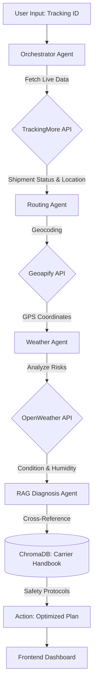

# Freyt: RAG-Based Multi-Agent Logistics System 🚛💎

Freyt is a professional-grade logistics management platform that orchestrates autonomous AI agents to track shipments, analyze weather risks, and optimize routes using **Retrieval-Augmented Generation (RAG)**.


## 🧠 System Architecture & Workflow

Freyt uses a collaborative agentic workflow. When a user enters a tracking ID, the "Brain" initiates the following sequence:



## ✨ Core Features

- **Autonomous Agentic Workflow**: Four specialized agents (Orchestrator, Weather, RAG, and Routing) collaborating in real-time.
- **Dynamic Geocoding**: Automatically converts any city name from tracking data into precise GPS coordinates.
- **RAG-Powered Diagnosis**: Uses LangChain and ChromaDB to analyze weather risks against the official **DHL Carrier Handbook**.
- **Real-Time API Integration**: Connected to TrackingMore (Live Shipping), OpenWeather, and Geoapify.
- **Premium UI**: A sleek, high-performance dark-mode dashboard built with Framer Motion and Tailwind CSS.
- **India Specialized**: Optimized hubs for Mumbai, Delhi, and Bengaluru for the Indian market.

## 🛠️ Tech Stack

- **Frontend**: React, Vite, Tailwind CSS, Framer Motion, Lucide Icons.
- **Backend**: FastAPI, Python, Uvicorn.
- **AI/LLM**: Google Gemini (Embeddings & Inference), LangChain.
- **Database**: ChromaDB (Vector Store).
- **APIs**: TrackingMore, OpenWeather, Geoapify.

## 🚀 Getting Started

### 1. Prerequisites
- Python 3.9+
- Node.js 18+
- API Keys for Gemini, TrackingMore, OpenWeather, and Geoapify.

### 2. Environment Setup
Create a `.env` file in the `backend/` directory:
```env
GOOGLE_API_KEY="your_gemini_key"
TRACKINGMORE_API_KEY="your_trackingmore_key"
OPENWEATHER_API_KEY="your_weather_key"
GEOAPIFY_API_KEY="your_geoapify_key"
```

### 3. Installation

**Backend:**
```bash
cd backend
pip install -r requirements.txt
python main.py
```

**Frontend:**
```bash
cd frontend
npm install
npm run dev
```

## 📈 Usage Modes

- **Real Mode**: Enter any real tracking ID from DHL, FedEx, etc.
- **Demo Mode**: Click the dedicated buttons for **Mumbai**, **Delhi**, or **BLR** to see the system's full capability even without a live package.

## 📄 License
This project is licensed under the MIT License - see the [LICENSE](LICENSE) file for details.
